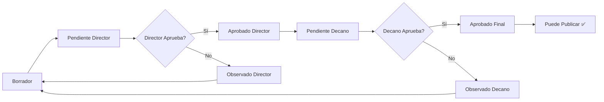

# 📋 Flujo de Aprobación de Horarios - FicTic

## 🔄 Flujo Completo: Generación → Aprobación → Publicación

### 1️⃣ Generación Automática de Horarios
**Módulo:** `GeneracionHorarioController`
**Ruta:** `/admin/generacion-horarios`

#### Proceso:
1. **Crear Nueva Generación**
   - Seleccionar Gestión y Carrera
   - El sistema procesa 114 grupos en segundo plano
   - Estado: `procesando` → `completado`

2. **Aplicar Horarios** ✨ **MEJORADO**
   - Botón "Aplicar Horarios" en la vista de detalles
   - **Acción del sistema:**
     - ✅ Elimina horarios antiguos de esa gestión/carrera
     - ✅ Copia horarios generados a tabla `horario_clases`
     - ✅ **NUEVO:** Crea automáticamente `AprobacionHorario` en estado `borrador`
     - ✅ Marca generación como `aplicado`
   
   ```php
   // Ahora al aplicar horarios se crea automáticamente:
   AprobacionHorario::updateOrCreate([
       'id_gestion' => $gestion,
       'id_carrera' => $carrera,
   ], [
       'estado' => 'borrador',
       'total_horarios' => 114,
       'horarios_validados' => 114,
       'conflictos_pendientes' => 0,
   ]);
   ```

---

### 2️⃣ Aprobación de Horarios (Flujo Jerárquico)
**Módulo:** `AprobacionHorarioController`
**Ruta:** `/admin/aprobaciones`

#### Estados del Proceso:



#### Roles y Acciones:

**🎓 Coordinador de Carrera:**
- ✅ Crea el proceso de aprobación (ahora automático al aplicar horarios)
- ✅ Puede ver el proceso en estado `borrador`
- ✅ **Enviar a Director:** Botón "Enviar a Director"
  - Valida que no haya conflictos críticos
  - Cambia estado a `pendiente_director`
  - Registra fecha de envío
  
**👔 Director de Carrera:**
- ✅ Ve procesos en estado `pendiente_director`
- ✅ Puede:
  - **Aprobar:** Cambia a `aprobado_director`
  - **Observar:** Cambia a `observado_director` con comentarios
- ✅ Si aprueba, el coordinador puede enviar a Decano

**🏛️ Decano de Facultad:**
- ✅ Ve procesos en estado `pendiente_decano`
- ✅ Puede:
  - **Aprobar:** Cambia a `aprobado_final` ✨ (listo para publicar)
  - **Observar:** Cambia a `observado_decano` con comentarios

---

### 3️⃣ Publicación de Horarios
**Módulo:** `PublicacionHorarioController`
**Ruta:** `/admin/publicacion-horarios`

#### Requisitos para Publicar:
```php
// Validación automática del sistema
$gestion->puede_publicar == true

// Condiciones:
1. ✅ Existe al menos una AprobacionHorario
2. ✅ Todas las aprobaciones están en estado 'aprobado_final'
3. ✅ No hay conflictos pendientes
```

#### Proceso de Publicación:
1. **Verificar:** Sistema valida `puede_publicar`
2. **Publicar:** Marca gestión como publicada
3. **Resultado:** Horarios visibles para:
   - 👨‍🏫 Docentes (ver su horario personal)
   - 👨‍🎓 Estudiantes (ver horario de su grupo)
   - 🏫 Administración (ver por aula)

---

## 🔧 Problema Resuelto

### ❌ Antes:
```
Generación Automática → Aplicar Horarios
                            ↓
                         (NADA) ❌
                            ↓
                    Publicación Directa ⚠️
```

### ✅ Después:
```
Generación Automática → Aplicar Horarios
                            ↓
                  Crea AprobacionHorario (borrador) ✅
                            ↓
                    Enviar a Director → Aprobar
                            ↓
                    Enviar a Decano → Aprobar Final
                            ↓
                      Publicación ✅
```

---

## 📝 Cambios Realizados

### 1. **GeneracionHorarioController::aplicar()**
**Archivo:** `app/Http/Controllers/GeneracionHorarioController.php`

**Mejora:**
```php
// Agregado después de aplicar horarios:
$aprobacion = \App\Models\AprobacionHorario::updateOrCreate([
    'id_gestion' => $generacionHorario->id_gestion,
    'id_carrera' => $generacionHorario->id_carrera,
], [
    'estado' => 'borrador',
    'total_horarios' => $generacionHorario->total_grupos,
    'horarios_validados' => $generacionHorario->grupos_asignados,
    'conflictos_pendientes' => $generacionHorario->conflictos_detectados ?? 0,
    'observaciones_coordinador' => 'Horarios generados automáticamente...',
    'id_usuario_coordinador' => auth()->id(),
]);
```

**Beneficio:**
- ✅ Conecta automáticamente Generación → Aprobación
- ✅ No requiere creación manual del proceso
- ✅ Mantiene trazabilidad completa

---

## 🎯 Flujo de Usuario Paso a Paso

### Para Coordinador:
1. Ir a **Generación Automática de Horarios**
2. Crear nueva generación → Esperar completado
3. Click en "Aplicar Horarios" ✅
4. **Automáticamente se crea AprobacionHorario**
5. Ir a **Aprobación de Horarios** → Ver proceso creado
6. Click en "Enviar a Director" ✅
7. Esperar respuesta del Director

### Para Director:
1. Ir a **Aprobación de Horarios**
2. Ver procesos en "Pendiente Director"
3. Revisar detalles y horarios
4. **Aprobar** o **Observar** con comentarios
5. Si aprueba → Coordinador puede enviar a Decano

### Para Decano:
1. Ir a **Aprobación de Horarios**
2. Ver procesos en "Pendiente Decano"
3. Revisar detalles y aprobación del Director
4. **Aprobar Final** ✅ → Estado: `aprobado_final`

### Para Administrador/Coordinador:
1. Ir a **Publicación de Horarios**
2. Sistema valida automáticamente `puede_publicar`
3. Si todo está aprobado → Botón "Publicar" habilitado ✅
4. Click en "Publicar" → Horarios visibles para todos

---

## 🔍 Verificación del Flujo

### Tabla: `aprobaciones_horario`
```sql
SELECT 
    id_aprobacion,
    id_gestion,
    id_carrera,
    estado,
    total_horarios,
    conflictos_pendientes,
    fecha_envio_director,
    fecha_respuesta_director,
    fecha_envio_decano,
    fecha_respuesta_decano
FROM aprobaciones_horario;
```

### Validaciones Importantes:

#### ✅ AprobacionHorario creada correctamente:
- `estado` = 'borrador' después de aplicar
- `id_usuario_coordinador` = usuario actual
- `total_horarios` = 114 (o cantidad generada)

#### ✅ Proceso Director:
- Coordinador puede enviar cuando `puede_enviar_director` = true
- Director ve cuando `estado` = 'pendiente_director'
- Al aprobar: `estado` = 'aprobado_director' + `fecha_respuesta_director`

#### ✅ Proceso Decano:
- Coordinador puede enviar cuando `estado` = 'aprobado_director'
- Decano ve cuando `estado` = 'pendiente_decano'
- Al aprobar: `estado` = 'aprobado_final' + `fecha_respuesta_decano`

#### ✅ Publicación:
```php
// Gestion::getPuedePublicarAttribute()
$aprobaciones = $this->aprobaciones;
return $aprobaciones->count() > 0 
    && $aprobaciones->every(fn($a) => $a->estado === 'aprobado_final');
```

---

## 🐛 Solución de Problemas

### Problema 1: "Enviar Director no funciona"
**Causa:** No existía AprobacionHorario  
**Solución:** ✅ Ahora se crea automáticamente al aplicar horarios

### Problema 2: "No puedo publicar"
**Causa:** Aprobaciones no están en estado 'aprobado_final'  
**Verificar:** 
```php
$gestion->aprobaciones->pluck('estado');
// Debe devolver: ['aprobado_final', 'aprobado_final', ...]
```

### Problema 3: "No veo el proceso de aprobación"
**Causa:** No se aplicaron los horarios generados  
**Solución:** Ir a Generación → Ver detalles → Click "Aplicar Horarios"

---

## 📊 Beneficios del Sistema

### ✅ Trazabilidad Completa:
- Registro de quién generó, aprobó, publicó
- Fechas de cada paso del proceso
- Observaciones y comentarios en cada nivel

### ✅ Control Jerárquico:
- Coordinador elabora
- Director revisa y aprueba
- Decano aprueba final
- Sistema valida antes de publicar

### ✅ Flexibilidad:
- Observaciones permiten correcciones
- Proceso puede volver atrás si hay observaciones
- Validación automática de conflictos

### ✅ Seguridad:
- No se puede publicar sin aprobaciones
- Cada rol tiene permisos específicos
- Bitácora registra todas las acciones

---

## 🚀 Próximos Pasos Recomendados

1. **Probar el Flujo Completo:**
   - Crear generación → Aplicar → Enviar Director → Aprobar → Enviar Decano → Aprobar → Publicar

2. **Verificar Permisos:**
   - Asignar roles correctos (Coordinador, Director, Decano)
   - Probar con cada rol para verificar accesos

3. **Optimizar Generación:**
   - Respetar turnos de grupos (Z1 → Sábados, Noche → Bloques 8-10)
   - Ajustar patrones de días en OptimizadorHorarios

4. **Notificaciones (Opcional):**
   - Email al Director cuando recibe aprobación
   - Email al Decano cuando recibe aprobación
   - Email al Coordinador cuando hay observaciones

---

## 📚 Archivos Modificados

```
✅ app/Http/Controllers/GeneracionHorarioController.php (línea 199-265)
   - Método aplicar() ahora crea AprobacionHorario automáticamente
```

## 📚 Archivos Relacionados (Sin Cambios)

```
✓ app/Http/Controllers/AprobacionHorarioController.php
✓ app/Http/Controllers/PublicacionHorarioController.php
✓ app/Models/AprobacionHorario.php
✓ app/Models/Gestion.php
✓ resources/views/aprobaciones/index.blade.php
✓ resources/views/aprobaciones/show.blade.php
✓ routes/Aprobaciones/Aprobaciones.php
```

---

**✅ Sistema de Aprobación Completamente Funcional**  
**Fecha:** 2024  
**Autor:** Sistema FicTic - Gestión de Horarios Académicos
